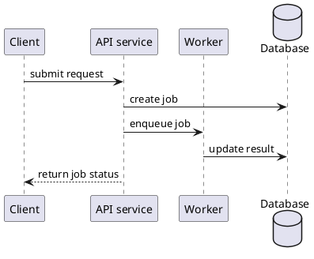
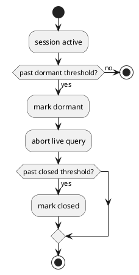
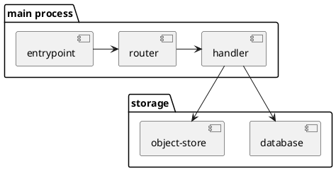

# PlantUML Patterns

Open this reference only when `plantuml-diagrams` needs syntax examples. This file is only a PlantUML pattern library; do not use it to choose diagram file locations. The examples below are syntax fragments; generated diagrams must still use the required file header from `SKILL.md`.

## Sequence

Use sequence diagrams for cross-process, cross-service, or adapter call chains.



## Activity

Use activity diagrams for one-actor workflows, decision trees, and state transitions.



## Component

Use component diagrams for module dependencies, process boundaries, and data flow.



## Notes

Add a PlantUML `note` where a design choice, invariant, rejection condition, or non-obvious ordering matters.

```plantuml
Caller -> Tool: invoke
note right
  Caller must exit the worktree first;
  calls from inside the worktree are rejected.
end note
```
